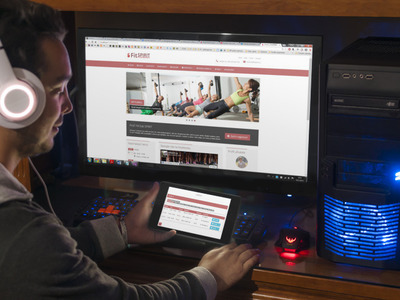

# FitSPIRIT

## Technologies
ASP.NET MVC, Bootstrap, jQuery UI, AJAX, NHibernate, JSON, Microsoft SQL server

## Cíl projektu
Cílem projektu je vytvořit rezervační a redakční systém pro fiktivní fitness centrum FitSpirit. V interní části aplikace rozlišuje 3 druhy rolí uživatelských účtů s různými oprávněními – klient, instruktor, obsluha. Externí funkce aplikace může využívat také nepřihlášený uživatel.

### Nepřihlášený uživatel
Každý návštěvník webové aplikace má možnost sledovat aktuální dění ve fitness centru. Má přístup k seznamu vypsaných a uplynulých lekcí, galerii, seznamu druhů aktivit, provozovaných fitness centrem a ceníku. Může zobrazit profily instruktorů, kteří aktuálně ve fitness centru pracují nebo seznam místností, ve kterých se konkrétní lekce odehrávají. Především má možnost registrovat se a přihlásit do systému, kde mu aplikace zpřístupní další funkce.

### Klient
Po úspěšné registraci musí klient vyčkat na aktivaci účtu obsluhou. Ta účet aktivuje po ověření údajů klienta na baru fitness centra. Zde si klient také může nabít kredit účtu, který poté uplatní při rezervacích na lekce. Do aplikace se klient přihlásí pod loginem, který mu aplikace vygenerovala, a heslem, které si sám zvolil.

V případě, že má klient dostatečný kredit, může se rezervovat na aktuálně vypsané lekce. Za každou registraci se mu odečte kredit v hodnotě ceny lekce dané aktivity. Rezervaci lze zrušit nejdéle do 6 hodin před zahájením lekce, přičemž se odečtený kredit přičte v plné výši zpět.

Správu rezervací provádí v podsekcích Lekce a Rezervace.

### Instruktor
Účet nového instruktora FitSpirit vytvoří obsluha. Instruktor má poté možnost vypsat novou lekci do systému – zvolí čas zahájení/ukončení, druh aktivity, místnost konání, kapacitu lekce a případně doplní poznámku. Lekce, na které dosud není přihlášen žádný klient, má možnost upravit či zrušit.

### Obsluha
Obsluha spravuje veškeré aktivity, místnosti, fotografie v galerii – to zahrnuje možnosti přidávání, úprav, deaktivace a mazání. V sekci Lekce má privilegia pro úpravy lekcí v případě, že původní instruktor například onemocní, ale lekci převezme instruktor náhradní. Obdobné náhlé změny lze řešit pouze přes obsluhu.

Obsluha dále udržuje evidenci o klientech, instruktorech a uživatelích v roli obsluhy. Mimo jiné má možnost vyhledat účet klienta, aktivovat ho a dobít uhrazený kredit. Obdobně má možnost deaktivovat účet instruktora. Implementováno je také rozhraní pro správu uživatelských rolí.

